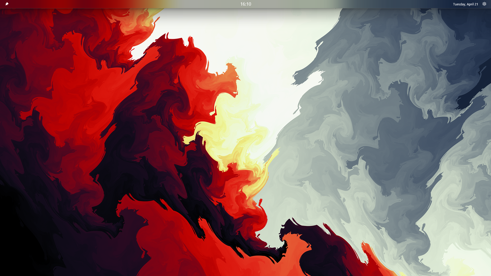

# Legend Bar

A custom top bar for Windows 11 with acrylic frosted glass, auto-hide, media controls, and dual monitor support.

<!-- Add a screenshot here: a full-width screenshot of both monitors showing the bar at the top with the media widget, clock, date, and settings icon visible. Save it as screenshot.png in the root of the repo and replace this comment with:  -->

---

## Features

- **Acrylic frosted glass** — matches Windows 11 aesthetic
- **Auto-hide** — slides up and out of the way when not in use, reappears when you move your mouse to the top edge
- **Pin mode** — locks the bar in place and reserves screen space so windows open below it
- **Media controls** — play/pause, previous, next for any media playing on your PC (Spotify, Firefox, Chrome, Edge, VLC, Screenbox, and more)
- **Per-app volume** — scroll over the media widget to change the volume of the currently playing app
- **Click to focus** — click the song title to bring the media app to the foreground
- **Clock** — center of the bar, 24-hour format
- **Date** — right side of the bar
- **Dual monitor support** — bar spans both monitors, widgets appear only on the primary monitor
- **Customizable** — bar height, acrylic tint, blur, show/hide speed, hide delay
- **Launch on startup** — optional, toggle in settings

---

## Requirements

- **Windows 11** (Windows 10 is not supported)
- **Display scale: 100% on all monitors** — other DPI settings are not supported yet
- **x64 system**

---

## Installation

### Step 1 — Install Windows App Runtime

Download and install the Windows App Runtime if you don't have it already:

👉 [Download Windows App Runtime](https://aka.ms/windowsappsdk/1.8/latest/windowsappruntimeinstall-x64.exe)

Run the installer and follow the prompts.

---

### Step 2 — Enable Developer Mode

LegendBar is distributed as a sideloaded package and requires Developer Mode to install.

1. Open **Settings**
2. Go to **System → For developers**
3. Turn on **Developer Mode**

---

### Step 3 — Download LegendBar

Go to the [Releases page](https://github.com/Baldev8910/LegendBar/releases/latest) and download all of the following files into the **same folder**:

- `LegendBar_x.x.x.x_x86_x64_arm64.msixbundle`
- `LegendBar_x.x.x.x_x86_x64_arm64.cer`
- `Install.ps1`

---

### Step 4 — Install the Certificate

Before installing the app, you need to trust the certificate:

1. Right-click `LegendBar_x.x.x.x_x86_x64_arm64.cer`
2. Click **Install Certificate**
3. Select **Local Machine** → click **Next**
4. Select **Place all certificates in the following store**
5. Click **Browse** → select **Trusted Root Certification Authorities** → click **OK**
6. Click **Next** → **Finish**

---

### Step 5 — Run the Installer

Right-click `Install.ps1` and select **Run with PowerShell**.

This will install LegendBar automatically. Once done, search for **LegendBar** in the Start menu and launch it.

---

## Settings

Click the ⚙️ gear icon on the right side of the bar to open settings.

| Setting | Description |
|---------|-------------|
| Bar Height | Height of the bar in pixels |
| Acrylic Tint | Darkness of the acrylic background |
| Acrylic Blur | Blur intensity of the acrylic background |
| Show Speed | How fast the bar slides down (ms) |
| Hide Speed | How fast the bar slides up (ms) |
| Hide Delay | How long to wait before hiding (ms) |
| Launch on Startup | Start LegendBar with Windows |
| Reset to Defaults | Restore all settings to default values |

---

## Uninstalling

1. Open **Settings → Apps → Installed Apps**
2. Search for **LegendBar**
3. Click the three dots → **Uninstall**

---

## Known Limitations

- **DPI scaling** — only 100% display scale is supported on all monitors. Other DPI settings may cause visual issues.
- **Browser volume** — scrolling to change volume controls the app's Windows audio session volume, not the browser's internal volume slider (e.g. YouTube's volume bar).
- **Multiple media apps** — if two media apps are playing simultaneously, the bar may not always focus the correct one when clicking the title.
- **Windows 11 only** — not tested on Windows 10.

---

## Built With

- [WinUI 3](https://learn.microsoft.com/en-us/windows/apps/winui/winui3/) — UI framework
- [Windows App SDK](https://learn.microsoft.com/en-us/windows/apps/windows-app-sdk/) — windowing and composition
- [NAudio](https://github.com/naudio/NAudio) — per-app audio session control
- C# / .NET 8

---

## License

This project is released under the [MIT License](LICENSE).
