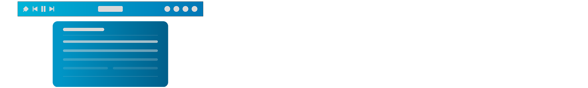

 
 

A customizable Windows 11 top bar built with WinUI 3.

Acrylic glass • Auto-hide • Media controls • Multi-monitor support

 

    

 

  

## Contents

- [Contents](#contents)
- [Why LegendBar?](#why-legendbar)
- [Screenshots](#screenshots)
- [Features](#features)
- [Requirements](#requirements)
- [Installation](#installation)
- [Uninstalling](#uninstalling)
- [Settings](#settings)
- [Known Limitations](#known-limitations)
- [Roadmap](#roadmap)
- [Contributing](#contributing)
- [Built With](#built-with)
- [License](#license)
- [Acknowledgements](#acknowledgements)

## Why LegendBar?

LegendBar was designed to bring a cleaner and more productive desktop workflow to Windows 11 while staying visually native to the operating system.

Unlike traditional desktop widgets or overlays, LegendBar integrates directly with WinUI 3, Win32 APIs, AppBar behavior, and Windows composition effects to create a lightweight top bar focused on usability, media control, productivity, and customization.

## Screenshots

 

 

 

 

 

 

---

## Features

<b>🎨 Interface & Appearance</b>

 

- Acrylic, Mica, Mica Alt, and Solid material support
- Live acrylic tint and blur customization
- Smooth auto-hide with cubic-ease animations
- Borderless always-on-top WinUI 3 window
- Thin Windows 11-style bottom border
- Dynamic popup material synchronization
- Adjustable bar height and animation speeds

<b>🖥️ Window & Monitor Integration</b>

 

- Full dual-monitor support
- Windows AppBar API integration for pinned mode
- Auto-hide detection using low-level mouse hooks
- Proper reserved screen space when pinned
- Hidden from Alt+Tab and taskbar switchers
- Re-asserts topmost state automatically

<b>🎵 Media Controls</b>

 

- System-wide media controls (Spotify, Chrome, Firefox, VLC, etc.)
- Play, pause, previous, and next controls
- Click song title to focus media app
- Per-app volume control via mouse wheel
- Animated volume overlay indicator
- Dynamic media session detection

<b>⏰ Productivity Widgets</b>

 

- Pomodoro timer with animated transitions
- Expandable timer controls (pause/reset/skip)
- Reminder system with recurring schedules
- Clipboard history with image support
- Quick Notes popup with Markdown + KaTeX rendering
- Clock and Date widgets
- PowerToys shortcuts reference panel
- DevToys launcher integration

<b>⚙️ Customization & Settings</b>

 

- Live settings preview
- Launch on startup support
- Widget visibility toggles
- Persistent JSON-based settings
- Reset-to-defaults support
- Dynamic popup resizing

<b>🛠️ Technical Highlights</b>

 

- Built with WinUI 3 and .NET 8
- Uses DesktopAcrylicController for true acrylic blur
- Uses Windows System Media Transport Controls (SMTC)
- Uses low-level Win32 hooks for edge detection
- Uses WebView2 for the Notes editor
- Uses NAudio for per-app audio sessions
- JSON-based persistence system
- Timer-driven custom animation engine

---

## Requirements

| Requirement | Details |
|---|---|
| Operating System | Windows 11 |
| Architecture | x64/x86/arm64 |
| Display Scaling | Same DPI scaling on all monitors |
| Runtime | Windows App Runtime |

---

## Installation

1. Go to the [Releases](https://github.com/Baldev8910/LegendBar/releases/latest) page
2. Download the appropriate latest installer as per your architecture
3. Run `LegendBar_X.X.X.X_xXX.msixbundle`
4. Launch LegendBar from the Start Menu

> [!IMPORTANT]
> Windows App Runtime is required.  
> If it is not already installed, the setup process will prompt you automatically.

> [!NOTE]
> Developer Mode may be required for sideloaded MSIX installation on some systems.

---

## Uninstalling

1. Open **Settings → Apps → Installed Apps**
2. Locate **LegendBar**
3. Click **Uninstall**

---

## Settings

Access settings from the ⚙️ icon on the right side of the bar.

| Category | Options |
|---|---|
| Appearance | Material type, acrylic tint, blur intensity, bar height |
| Animation | Show speed, hide speed, hide delay |
| Widgets | Toggle visibility for Clock, Date, Media, and utility widgets |
| System | Launch on startup, reset to defaults |
| Behavior | Temperature unit and interaction settings |

All settings are applied live and saved automatically.

---

## Known Limitations

- Browser volume scrolling adjusts the Windows audio session volume, not in-page player volume (e.g. YouTube volume slider)
- When multiple media apps are playing simultaneously, title focus detection may occasionally target the wrong app
- Windows 10 is currently unsupported and untested

---

## Roadmap

- [x] DPI scaling support
- [ ] Plugin/widget system
- [ ] Custom themes
- [ ] Keyboard shortcut customization
- [x] Weather widget
- [ ] Calendar integration
- [ ] Performance optimization pass

---

## Contributing

Contributions, bug reports, feature suggestions, and pull requests are welcome.

If you encounter issues or have ideas for improvements, feel free to open an issue or discussion.

---

## Built With

- 
- 
- 
- 
- 
- 
- 

---

## License

This project is released under the [MIT License](LICENSE).

---

## Acknowledgements

LegendBar was built as an experimental Windows 11 desktop enhancement project focused on acrylic composition, low-level window management, and productivity tooling.

Inspired by the flexibility of custom desktop environments and utility bars found across Linux and macOS ecosystems — rebuilt for native Windows 11 using WinUI 3 and Win32 APIs.
